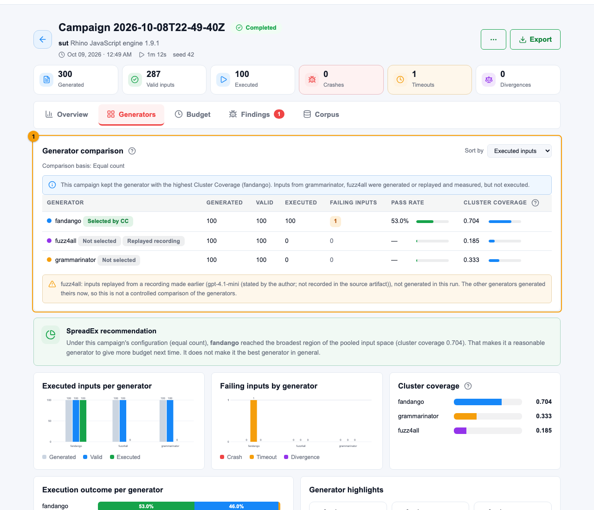

<div align="center">


# SpreadEx

**Run several grammar-based test generators against your program, compare them,<br>and spend a fixed budget on the most diverse inputs first.**

[](https://github.com/ShifatSahariar/SpreadEx/actions/workflows/ci.yml)
[](https://github.com/ShifatSahariar/SpreadEx/actions/workflows/acceptance.yml)
[](LICENSE)
[](https://github.com/ShifatSahariar/Embedding-based-Diversity-Mapping)


-ED8B00?style=for-the-badge&logo=openjdk&logoColor=white)


</div>

---

<p align="center">
  
</p>

## ✨ What it does

| | |
|---|---|
| 🧬 **Generate** | Fandango, Grammarinator, FuzzingBook and ISLa, each in its own pinned environment, from one grammar or one per generator |
| 🗺️ **Compare** | Embeds every input, clusters them, and scores each generator by **Cluster Coverage** before anything runs |
| 🎯 **Prioritize** | Runs the most diverse inputs first within your time or test budget |
| ⚖️ **Judge** | Separates **crashes**, **timeouts** and **divergences** from inputs your program **correctly rejects** |
| 🔁 **Reproduce** | Every run records its inputs, versions and checksums; findings replay with one click |
| 🖥️ **Workbench** | A five-step local wizard, results views and built-in **Guides** |

## 🚀 Quick start

```bash
pipx install git+https://github.com/ShifatSahariar/SpreadEx.git
```

```bash
spreadex demo          # a real campaign on a small calculator with one real bug
```

Then open the Workbench in your own project:

```bash
cd my-project
spreadex               # the wizard writes spreadex.yaml for you
```

> **Try a real engine:** `spreadex example rhino` sets up the public Rhino 1.9.1 JavaScript engine (downloaded once, SHA-256 verified) with three generators. Needs Java 11+.

## 🧰 Commands

```bash
spreadex init                  # write spreadex.yaml for this project
spreadex doctor                # check the setup; every problem comes with its fix
spreadex generators install fandango grammarinator
spreadex run                   # generate → compare → prioritize → execute → judge
spreadex ui                    # open the Workbench
spreadex results               # how the last campaign went (--all lists them)
spreadex replay <run>          # inspect a past campaign, or --execute it again
spreadex record <run> <gen> -o <dir>   # save a generator's inputs to replay later
spreadex export                # zip the manifest, results and failing inputs
```

<details>
<summary>More commands and flags</summary>

```bash
spreadex example rhino [dir]   # the Rhino showcase project
spreadex runtimes install rhino
spreadex grammar check <file>  # diagnose a grammar; see what each generator supports
spreadex grammar adapt <file>  # derive every generator's dialect
spreadex runs cancel|delete    # manage campaigns
spreadex ui --list | --stop | --read-only

spreadex run --budget 10m -j 8 --selection-signal cc|random --fail-on new-failure
```

The full reference, generated from the CLI itself, is in the Workbench under **Guides → Troubleshooting & CLI**.
</details>

## 🧪 Generators

| Generator | Family | Constraints | Mode |
|---|---|:---:|---|
|  | Constraint-based | ✅ | fresh |
|  | Probabilistic | — | fresh |
|  | Probabilistic | — | fresh |
|  | Constraint-based | ✅ | fresh |
|  | LLM-based | — | replays a recording · live generation not available yet |

Installs are deterministic (exact pins, isolated environments, never implicit). Grammars can be BNF, EBNF, ANTLR `.g4`, Fandango or FuzzingBook; SpreadEx converts between them.

## 🔒 Local-first

Your program, its inputs and every result stay in your project's `.spreadex/` folder. The network is used only when you ask: installing a generator (PyPI), opening the Rhino example (Maven Central), or the optional, experimental grammar assistant.

```
my-project/
├── spreadex.yaml
└── .spreadex/   corpus.db · blobs/ · runs/<id>/manifest.json
```

## 📄 Research

The algorithms are those of the ICST 2026 paper *Embedding-based Diversity Mapping for Test Generator Selection and Input Prioritization in Grammar-based Testing*. A CI gate checks this implementation against the published code.
Research code and replication package: **[Embedding-based-Diversity-Mapping](https://github.com/ShifatSahariar/Embedding-based-Diversity-Mapping)** · Artifact: [doi.org/10.5281/zenodo.20071065](https://doi.org/10.5281/zenodo.20071065)

> Cluster Coverage and prioritization are heuristics for spending a budget well; they do not predict faults.

## 🛠️ Development

```bash
pip install -e ".[dev]"
pytest -q -m "not network" --ignore=tests/golden
```

```bash
pip install -e ".[golden]"     # the research-equivalence gate
SPREADEX_REQUIRE_GOLDEN=1 pytest tests/golden -q
```

<details>
<summary>Status and platforms</summary>

**v0.1.0-alpha.** Verified from a clean install on **macOS arm64**. **Linux** is partly verified (the Rhino journey on arm64, the demo journeys on x86_64); the unit suite has not yet passed there. **Windows is unverified.** Not yet: coverage collection, regression mode, adaptive allocation, live Fuzz4All.
</details>

<div align="center"><sub>MIT licensed · Built for grammar-based testing research and practice</sub></div>
